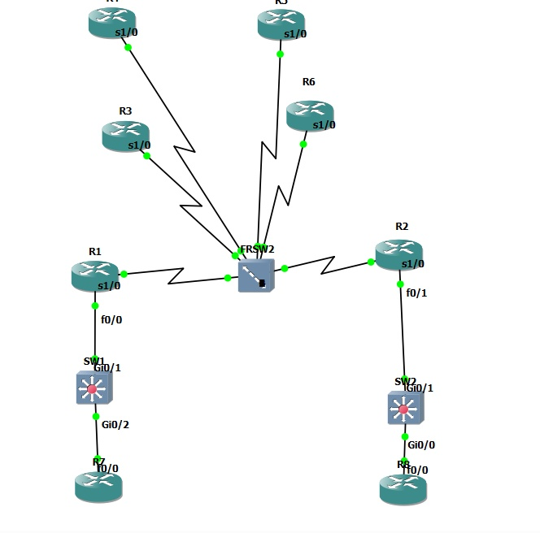
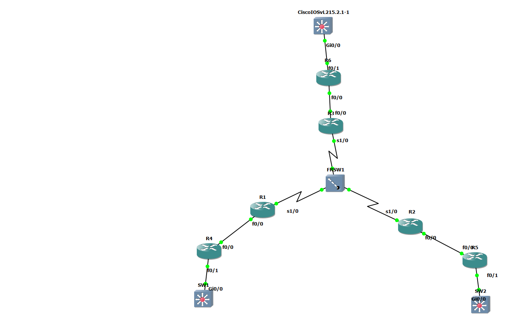

# 🌐 GRE Tunnel Study (Static & Dynamic)

> Cisco 라우터를 활용한 **GRE Tunnel (Static / Dynamic)** 구성 실습 저장소입니다.  
> Frame-Relay 백본 위에 OSPF로 공중망(Public Network)을 구성하고,  
> SOL-A(본사) ↔ SOL-B(지사) 간을 **GRE Tunnel**로 연결한 후,  
> NAT Overload(PAT) 및 EIGRP 기반 사설망 라우팅까지 구성합니다.

---

## 📑 목차 (Table of Contents)

- [1. 토폴로지 (Topology)](#1-토폴로지-topology)
- [2. 장비 구성 (Device Role)](#2-장비-구성-device-role)
- [3. 기본 구성 (Basic Configuration)](#3-기본-구성-basic-configuration)
- [4. Chapter 1. 공중망 구성 (OSPF)](#4-chapter-1-공중망-구성-ospf)
- [5. Chapter 2. NAT Overload (PAT) 구성](#5-chapter-2-nat-overload-pat-구성)
- [6. Chapter 3. GRE Tunnel (Static) 구성](#6-chapter-3-gre-tunnel-static-구성)
- [7. Chapter 4. GRE Tunnel (Dynamic) + EIGRP 구성](#7-chapter-4-gre-tunnel-dynamic--eigrp-구성)
- [8. 패킷 분석 (Packet Analysis)](#8-패킷-분석-packet-analysis)
- [9. 검증 명령어 (Verification)](#9-검증-명령어-verification)

---

## 1. 토폴로지 (Topology)

---
# GRE 토폴로지

---
# MGRE 토폴로지

---


---

## 2. 장비 구성 (Device Role)

| 장비 | Hostname | 역할 | 주요 IP |
|------|----------|------|---------|
| R1 | SOL-A (GIT-A) | 본사 Gateway | s1/0.10: 121.160.10.1 / Lo0: 100.100.1.1 |
| R2 | SOL-B (GIT-B) | 지사 Gateway | s1/0.20: 121.160.20.2 / Lo0: 100.100.2.2 |
| R3 | ISP-1 | 공중망 | 121.160.10.11 / 121.160.12.1 |
| R4 | ISP-2 | 공중망 | 121.160.12.2 / 121.160.23.2 / Lo120: 120.20.2.2 |
| R5 | ISP-3 | 공중망 | 121.160.23.3 / 121.160.34.3 / Lo130: 130.30.3.3 |
| R6 | ISP-4 | 공중망 | 121.160.34.4 / 121.160.20.4 |
| R7 | PC1 | SOL-A 내부 PC | 192.168.10.1 |
| R8 | PC2 | SOL-B 내부 PC | 192.168.20.2 |

---

## 3. 기본 구성 (Basic Configuration)

각 라우터의 hostname, loopback, frame-relay 기본 설정은  
[`configs/basic/`](./configs/basic/) 폴더를 참고하세요.

---

## 4. Chapter 1. 공중망 구성 (OSPF)

- **OSPF Process** : 1
- **Area** : 0
- **Router-ID** : SOL = X.X.X.X / ISP = XX.XX.XX.XX
- SOL-A, SOL-B의 **사설망은 OSPF에서 제외**
- ISP의 모든 네트워크 + Loopback 120/130은 OSPF 포함
- `passive-interface default` 사용으로 필요 인터페이스만 OSPF 활성화

👉 상세 설정 : [`configs/chapter1-OSPF/`](./configs/chapter1-OSPF/)

---

## 5. Chapter 2. NAT Overload (PAT) 구성

- SOL-A : 192.168.10.0/24 → Serial1/0.10 IP (121.160.10.1) 로 PAT
- SOL-B : 192.168.20.0/24 → Serial1/0.20 IP (121.160.20.2) 로 PAT

👉 상세 설정 : [`configs/chapter2-NAT/`](./configs/chapter2-NAT/)

---

## 6. Chapter 3. GRE Tunnel (Static) 구성

- Tunnel IP : **172.16.10.0/24**
- Tunnel Source/Destination : 물리 인터페이스 IP (121.160.10.1 ↔ 121.160.20.2)
- 사설망 통신을 위해 **Static Route** 사용

👉 상세 설정 : [`configs/chapter3-GRE-Static/`](./configs/chapter3-GRE-Static/)

---

## 7. Chapter 4. GRE Tunnel (Dynamic) + EIGRP 구성

- Tunnel IP : **172.16.100.0/24**
- Tunnel Source/Destination : **Loopback 0** IP (100.100.1.1 ↔ 100.100.2.2)
- EIGRP AS 100 으로 Tunnel 위에서 사설망 동적 라우팅

👉 상세 설정 : [`configs/chapter4-GRE-Dynamic/`](./configs/chapter4-GRE-Dynamic/)

---

## 8. 패킷 분석 (Packet Analysis)

GRE Tunnel을 통해 흐르는 패킷 캡슐화 구조:

```
================================================================
| FR DLCI | New IP Header | GRE Header | Original IP | Payload |
----------------------------------------------------------------
|   103   | SA:121.160.10.1| Type 0x0800| SA:192.168.10.1| ICMP |
|         | DA:121.160.20.2|            | DA:192.168.20.2|     |
================================================================
```

---

## 9. 검증 명령어 (Verification)

```bash
show ip interface brief
show ip route
show ip ospf neighbor
show ip eigrp neighbors
show ip nat translation
show interface tunnel 12
ping <destination>
traceroute <destination>
```

---

## 🔗 관련 저장소

- [Frame-Relay-Basic-Study](https://github.com/KSNAM97/Frame-Relay-Basic-Study)

## 🛠️ Tools Used

- GNS3 / Dynamips
- Cisco IOS (c7200)
- Wireshark (패킷 캡처)

## 📜 License

MIT License
